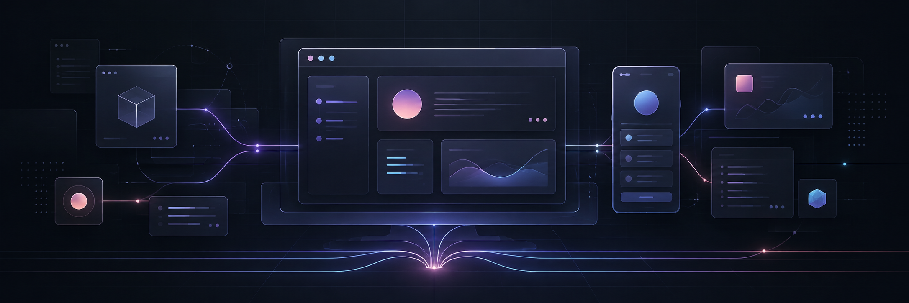

# Mohammadreza Mahdavi

### Product-focused software builder

I turn recurring problems into focused desktop, web, and Android products— 
local-first when possible, polished and practical by default.

 

> I build software that earns its place: clear interfaces, durable local data,
> recoverable workflows, and releases tested as actual products—not merely code
> that happened to compile.

## Featured products

<table>
<tr>
<td width="50%" valign="top">

### [StickyTabs](https://github.com/orphick/StickyTabs)

An intentionally simple Windows notes app where every tab stays an ordinary
`.txt` file. No account, cloud dependency, proprietary format, or telemetry.

  

[**Source →**](https://github.com/orphick/StickyTabs) · [**Latest release →**](https://github.com/orphick/StickyTabs/releases/latest)

</td>
<td width="50%" valign="top">

### [MKV Muxing Batch](https://github.com/orphick/mkv-muxing-batch)

A maintained MKVToolNix desktop workflow with queue recovery, metadata
templates, subtitle-safety checks, diagnostics, and verified Windows packages.

  

[**Source →**](https://github.com/orphick/mkv-muxing-batch) · [**Latest release →**](https://github.com/orphick/mkv-muxing-batch/releases/latest)

</td>
</tr>
<tr>
<td width="50%" valign="top">

### [TempoTempo](https://github.com/orphick/TempoTempo)

A Persian/RTL digital gaming marketplace with accounts, cart and wishlist
flows, transactional checkout, reviews, administration, and backend coverage.

  

[**Source →**](https://github.com/orphick/TempoTempo) · [**Live application →**](https://tempo-tempo.vercel.app)

</td>
<td width="50%" valign="top">

### [WarMode OS](https://github.com/orphick/warmode-os)

A local-first personal command room built around finite daily briefings,
routines, nutrition, and focused execution—not another engagement feed.

  

[**Source →**](https://github.com/orphick/warmode-os) · [**Live application →**](https://warmode-os.vercel.app)

</td>
</tr>
</table>

## Working stack

    

    

<strong>How I approach product work</strong>

 

- **Product before feature count:** the workflow should feel coherent from the
  first screen to the shipped artifact.
- **Local ownership where it matters:** user data should remain understandable,
  portable, and recoverable.
- **Evidence over claims:** source tests, packaged applications, deployed pages,
  and physical devices are different verification surfaces.
- **Calm interfaces:** useful software should reduce friction and attention
  cost, not manufacture more of it.

 

### Building small, serious products that solve real problems.

